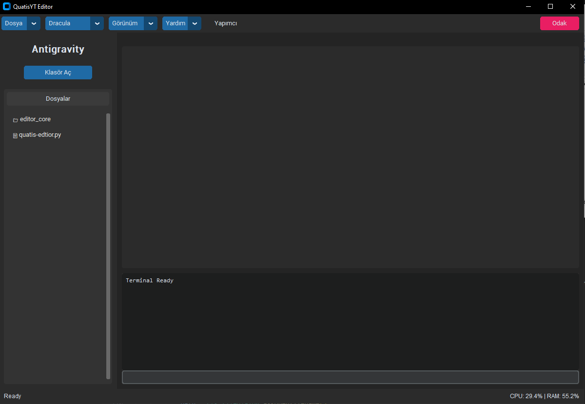

# 🚀 QuatisYT Editor

QuatisYT Editor, Python ve `customtkinter` kullanılarak geliştirilmiş, modern ve kullanıcı dostu bir metin editörüdür. Hem hafif yapısı hem de güçlü özellikleriyle kod yazmayı ve metin düzenlemeyi keyifli hale getirir.



## ✨ Özellikler

- 🎨 **Modern Arayüz:** Karanlık mod (Dark Mode) desteği ve estetik tasarım.
- 🌈 **Dinamik Temalar:** Dracula ve daha birçok premium tema seçeneği ile kişiselleştirilebilir görünüm.
- 📂 **SideBar (Kenar Çubuğu):** Kolay dosya gezintisi ve yönetimi.
- 📑 **Sekmeli Düzen:** Aynı anda birden fazla dosya üzerinde çalışabilme.
- 💻 **Entegre Terminal:** Editörden çıkmadan komut çalıştırma imkanı.
- 🎯 **Odak Modu:** Tüm dikkat dağıtıcıları gizleyen, sadece kodunuza odaklanmanızı sağlayan mod.
- 📊 **Sistem İstatistikleri:** CPU ve RAM kullanımını canlı olarak takip edebileceğiniz durum çubuğu.
- ⌨️ **Klavye Kısayolları:** Hızlı kaydetme ve mod değiştirme için özelleştirilmiş kısayollar.

## 🛠️ Kurulum

Projeyi yerel makinenizde çalıştırmak için aşağıdaki adımları izleyin:

1. **Depoyu klonlayın:**
   ```bash
   git clone https://github.com/kullaniciadi/quatis-editor.git
   cd quatis-editor
   ```

2. **Gerekli kütüphaneleri yükleyin:**
   ```bash
   pip install customtkinter psutil
   ```
   *(Eğer `editor_core` içinde başka bağımlılıklar varsa onları da yüklemeyi unutmayın)*

3. **Editörü başlatın:**
   ```bash
   python quatis-edtior.py
   ```

## ⌨️ Kısayollar

| Kısayol | İşlev |
|---------|-------|
| `Ctrl + S` | Mevcut dosyayı kaydet |
| `Ctrl + K` + `Z` | Odak (Zen) Modunu aç/kapat |
| `Ctrl + ~` | Terminali göster/gizle |

## 👨‍💻 Yapımcı

- **Geliştirici:** QuatisYT
- **Discord:** quatisytt

---
*Bu proje eğlence ve öğrenme amaçlı geliştirilmiştir. Katkıda bulunmaktan çekinmeyin!*
